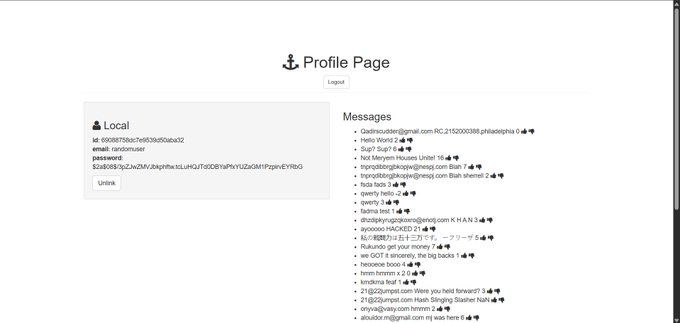

# Savage-Auth Project

A full-stack web application that allows users to **sign up, log in, and interact on a message board**. Users can post messages, give thumbs up/down, and manage their accounts by signing in, logging out, and creating new accounts!.

## Tech Stack

- **Backend:** Node.js, Express.js  
- **Database:** MongoDB with Mongoose  
- **Authentication:** Passport.js
- **Frontend:** EJS templating, HTML, CSS!

[Live Link](https://savage-auth-production-25bb.up.railway.app/) 
